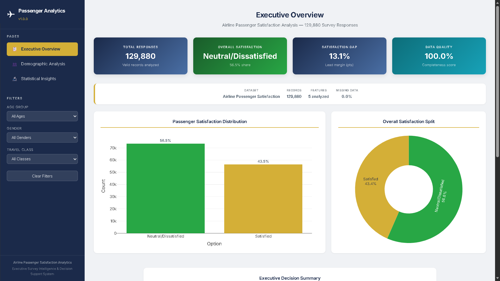
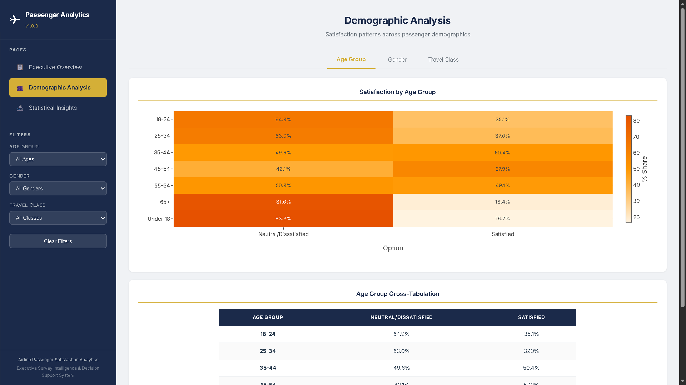
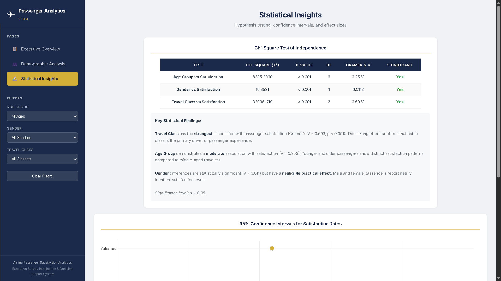
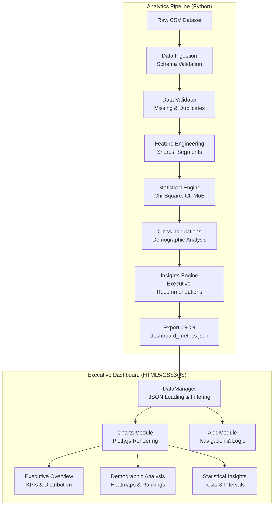

<div align="center">

# AIRLINE PASSENGER SATISFACTION ANALYTICS

### Executive Survey Intelligence & Decision Support System

**Python Analytics Pipeline with Interactive Executive Dashboard**

[](https://python.org)
[]()
[]()
[]()
[]()
[]()
[]()
[](LICENSE)
[]()
[]()

---

**Airline Passenger Satisfaction Analytics** is a full-stack data analytics platform that transforms raw airline survey data into actionable executive intelligence. Featuring a Python analytics backend and a responsive JavaScript executive dashboard, it analyzes **129,880 survey responses** to reveal statistically significant patterns in passenger satisfaction across demographic segments.

[**Live Dashboard**](https://girishshenoy16.github.io/airline-passenger-satisfaction-analytics/) | [**Project Report**](reports/project_report.md) | [**Executive Summary**](reports/executive_summary.md)

</div>

---

## Live Demo

<div align="center">

**[Launch Live Dashboard](https://girishshenoy16.github.io/airline-passenger-satisfaction-analytics)**

</div>

<div align="center">



*Executive Dashboard — Real-time KPIs, satisfaction analytics, and demographic insights*

</div>

---

## Project Statistics

<div align="center">

| Metric                  | Value           |
|-------------------------|-----------------|
| **Dashboard Pages**     | 3               |
| **Survey Responses**    | 129,880         |
| **Demographic Dimensions** | 3            |
| **Statistical Tests**   | 4               |
| **Python Modules**      | 7               |
| **JavaScript Modules**  | 3               |
| **Lines of Code**       | 2,500+          |
| **Analysis Pipeline**   | Chi-Square, Cramér's V, CI, MoE |
| **Deployment**          | GitHub Pages    |

</div>

---

## Executive Overview

**Airline Passenger Satisfaction Analytics** is a complete data analytics system that provides executive-level intelligence from airline survey data. The system combines a Python statistical engine with an interactive dashboard to deliver actionable insights for senior decision-makers.

### What It Solves

| Challenge               | Industry Impact                                | Analytics Solution                              |
|-------------------------|------------------------------------------------|-------------------------------------------------|
| **Data Fragmentation**  | Survey data locked in spreadsheets             | Centralized analytics pipeline                  |
| **Manual Analysis**     | Hours of Excel analysis per dataset            | Automated statistical engine (<30 seconds)      |
| **Insight Communication** | Raw statistics don't reach executives       | Executive dashboard with KPI cards and charts   |
| **Demographic Gaps**    | One-size-fits-all service approach             | Cross-tabulations reveal segment-specific patterns |

### Target Users

| User Role                | Use Case                                     |
|--------------------------|----------------------------------------------|
| **C-Suite Executives**   | Operational awareness and KPI monitoring     |
| **Business Analysts**    | Deep-dive demographic analysis               |
| **Product Managers**     | Service improvement prioritization           |
| **Research Analysts**    | Statistical validation and reporting         |

---

## Project Highlights

<div align="center">

|                              |                               |                              |
|:----------------------------:|:-----------------------------:|:----------------------------:|
| **Executive Dashboard**      | **Python Analytics Pipeline** | **Statistical Engine**       |
|  **Interactive Filters**     |  **Automated Insights**       |    **Cross-Tabulations**     |
|  **Plotly.js Charts**        |  **Confidence Intervals**     | **GitHub Pages Deployment**  |

</div>

---

## Problem Statement

Airlines collect vast amounts of passenger feedback but struggle to transform raw survey data into actionable intelligence:

- **Manual analysis** takes hours per dataset using spreadsheets
- **Statistical expertise** required for hypothesis testing and effect sizes
- **Executive communication** challenges — raw numbers don't drive decisions
- **Demographic blind spots** — one-size-fits-all service approaches miss segment-specific issues
- **No standardized framework** for survey analytics across the organization

**Airline Passenger Satisfaction Analytics** addresses these challenges with automated statistical analysis, executive visualization, and data-driven recommendations.

---

## Key Features

### Executive Dashboard
- Real-time KPI cards (Total Responses, Overall Satisfaction, Satisfaction Gap, Data Quality)
- Dataset information card with completeness metrics
- Passenger satisfaction distribution charts
- Executive Decision Summary with actionable insights

### Demographic Analysis
- Interactive demographic slicers (Age Group, Gender, Travel Class)
- Cross-tabulation heatmaps with percentage breakdowns
- Travel class performance rankings
- Tab-based navigation between demographic dimensions

### Statistical Insights
- Chi-Square test results with Cramér's V effect sizes
- 95% Confidence Interval error bar charts
- Margin of Error summary by satisfaction status
- Business-focused interpretation of statistical findings

### Python Analytics Pipeline
- Automated CSV loading and validation
- Feature engineering (response shares, demographic segments)
- Statistical engine (Chi-Square, Cramér's V, CI, MoE)
- Rule-based executive insight generation

### Interactive Filters
- Single-dimension filtering by Age Group, Gender, or Travel Class
- Dynamic KPI and chart updates on filter change
- Clear Filters button for quick reset
- Real-time data processing

### Executive Insights
- Automated lead margin calculations
- Top satisfaction drivers identification
- Risk-based severity classification
- Data-driven strategic recommendations

### Data Quality Assessment
- Missing value detection and reporting
- Duplicate record identification
- Schema validation
- Completeness scoring

---

## Results

<div align="center">

| Achievement                 | Result   |
|-----------------------------|----------|
| **Total Responses**         | 129,880  |
| **Overall Satisfaction**    | 43.45%   |
| **Dissatisfaction Rate**    | 56.55%   |
| **Satisfaction Gap**        | 13.1 pts |
| **Data Quality**            | 100%     |
| **Travel Class Effect**     | V=0.503 (Strong) |
| **Age Group Effect**        | V=0.253 (Moderate) |
| **Gender Effect**           | V=0.011 (Negligible) |
| **Analysis Time**           | <30 seconds |
| **Hosting Cost**            | $0/month |

</div>

---

## Screenshots

<div align="center">

### Executive Overview

*Real-time KPIs, satisfaction distribution, and executive decision summary*

---

### Demographic Analysis

*Interactive heatmaps, cross-tabulations, and travel class rankings*

---

### Statistical Insights

*Chi-Square results, confidence intervals, and margin of error analysis*

</div>

---

## Tech Stack

<div align="center">

| Category             | Technologies                                                           |
|----------------------|------------------------------------------------------------------------|
| **Backend**          | Python 3.9+, pandas, NumPy, SciPy, PyYAML                             |
| **Frontend**         | HTML5, CSS3, JavaScript ES6, Plotly.js                                 |
| **Statistical**      | Chi-Square Test, Cramér's V, Confidence Intervals, Margin of Error    |
| **Visualization**    | Plotly.js (bar, donut, heatmap, error bar charts)                      |
| **Typography**       | Google Fonts (Inter)                                                   |
| **Deployment**       | GitHub Pages                                                           |

</div>

---

## System Architecture



---

## Installation

### Quick Start (Dashboard Only)

```bash
# Clone the repository
git clone https://github.com/girishshenoy16/airline-passenger-satisfaction-analytics.git
cd airline-passenger-satisfaction-analytics

# Start local server
python -m http.server 8000 --directory docs

# Open browser
http://localhost:8000
```

### Full Stack (Pipeline + Dashboard)

```bash
# Clone the repository
git clone https://github.com/girishshenoy16/airline-passenger-satisfaction-analytics.git
cd airline-passenger-satisfaction-analytics

# Create and activate virtual environment
python -m venv .venv
# Windows:
.venv\Scripts\activate
# Linux/Mac:
source .venv/bin/activate

# Install dependencies
pip install --upgrade pip
pip install -r requirements.txt

# Run analytics pipeline
python run_pipeline.py

# Start dashboard server
python -m http.server 8000 --directory docs
```

---

## Folder Structure

```
airline-passenger-satisfaction-analytics/
├── docs/                          # Dashboard (GitHub Pages root)
│   ├── index.html                 # Main dashboard page
│   ├── css/
│   │   └── styles.css             # Executive theme styling
│   ├── js/
│   │   ├── app.js                 # Application logic
│   │   ├── charts.js              # Plotly.js chart rendering
│   │   └── data.js                # Data loading module
│   ├── outputs/
│   │   └── dashboard_metrics.json # Dashboard data
│   └── assets/
│       └── screenshot-*.png       # Dashboard screenshots
├── data/
│   ├── raw/
│   │   └── train.csv              # Airline passenger dataset
│   └── processed/
│       └── processed_survey_data.csv
├── outputs/
│   └── dashboard_metrics.json     # Generated metrics
├── reports/
│   ├── project_report.md          # Technical documentation
│   └── executive_summary.md       # Business-focused overview
├── src/
│   ├── __init__.py                # Package initialization
│   ├── data_ingestion.py          # CSV loading
│   ├── data_validator.py          # Validation checks
│   ├── feature_engineering.py     # Derived features
│   ├── statistical_engine.py      # Chi-Square, CI, MoE
│   ├── analyzer.py                # Cross-tabulations
│   └── insights_engine.py         # Executive recommendations
├── config/
│   └── settings.yaml              # Configuration parameters
├── run_pipeline.py                # Pipeline orchestrator
├── requirements.txt               # Python dependencies
└──  README.md                      # Portfolio documentation
```

---

## Statistical Methodology

| Method | Purpose | Application |
|--------|---------|-------------|
| **Chi-Square (χ²)** | Tests independence between variables | Demographics vs. Satisfaction |
| **Cramér's V** | Measures effect size (0 = none, 1 = perfect) | Strength of association |
| **95% Confidence Interval** | Range for true population proportion | Satisfaction rate precision |
| **Margin of Error** | Maximum expected sampling error | Survey reliability |

---

## Key Findings

<div align="center">

| Factor | Cramér's V | Effect Size | Business Insight |
|--------|------------|-------------|------------------|
| **Travel Class** | 0.503 | Strong | Primary driver — Economy has 81.2% dissatisfaction |
| **Age Group** | 0.253 | Moderate | Youth (<18) and seniors (65+) most dissatisfied |
| **Gender** | 0.011 | Negligible | No practical difference between Male/Female |

</div>

---

## Input Data Format

Your CSV must contain these required columns:

| Column | Type | Description | Example |
|--------|------|-------------|---------|
| `respondent_id` | String | Unique identifier | R00001 |
| `age_group` | Categorical | Age bracket | 25-34 |
| `gender` | Categorical | Gender category | Male |
| `travel_class` | Categorical | Cabin class | Economy |
| `selected_option` | Categorical | Satisfaction status | Satisfied |

---

## Dashboard Pages

### Page 1: Executive Overview
- KPI cards: Total Responses, Overall Satisfaction, Satisfaction Gap, Data Quality
- Dataset information card
- Passenger satisfaction distribution charts
- Executive Decision Summary with actionable insights

### Page 2: Demographic Analysis
- Interactive demographic slicers (Age, Gender, Travel Class)
- Cross-tabulation heatmaps
- Travel class performance rankings

### Page 3: Statistical Insights
- Chi-Square test results with Cramér's V
- 95% Confidence Interval error bar charts
- Margin of Error summary by satisfaction status

---

## Reports

<div align="center">

| Report | Description |
|--------|-------------|
| **[Project Report](reports/project_report.md)** | Technical documentation covering architecture, statistical methodology, and implementation details |
| **[Executive Summary](reports/executive_summary.md)** | C-suite briefing with key metrics, findings, and strategic recommendations |

</div>

---

## Configuration

Edit `config/settings.yaml` to customize:

- Statistical thresholds (significance level, confidence level)
- Color palettes and executive theme
- Required column definitions
- Insight generation parameters

---

## Limitations

The Level 1 MVP has the following inherent limitations:

- Supports only one survey dataset at a time
- Statistical analysis limited to Chi-Square, Cramér's V, Confidence Intervals, and Margin of Error
- Dashboard consumes precomputed analytics artifacts rather than performing calculations in the browser
- Filtering limited to implemented demographic dimensions (Age, Gender, Travel Class)
- CSV-based input only (no database connectivity)
- Designed for structured survey data only (no free-text sentiment analysis)

---

## Future Scope

<div align="center">

| Priority | Enhancement |
|----------|-------------|
| High | Additional survey sources (Google Forms, Microsoft Forms, etc.) |
| High | Advanced multi-dimensional filtering and drill-down analysis |
| Medium | Time-series analysis for recurring surveys |
| Medium | Automated PDF report generation |
| Medium | Database integration (PostgreSQL/MySQL) |
| Low | Cloud deployment improvements (AWS/GCP/Azure) |
| Low | Additional executive dashboard visualizations |
| Low | Configurable business rules for executive insight generation |

</div>

---

## Repository Features

<div align="center">

|                        |                  |                     |
|:----------------------:|:----------------:|:-------------------:|
|      MIT License       |   GitHub Pages   |   Statistical Engine |
| Interactive Dashboards |  Executive KPIs  |  Cross-Tabulations  |
|   Confidence Intervals | Plotly.js Charts |  Automated Insights |
|     Data Validation    |  Responsive UI   |    Modular Design   |

</div>

---

## Contact

<div align="center">

**Girish Shenoy**

[](https://github.com/girishshenoy16)
[](https://linkedin.com/in/girishshenoys)
[](mailto:girishpshenoy09@gmail.com)

</div>

> Open to opportunities in Data Analytics, Business Intelligence, and Data Science.

---

## License

This project is licensed under the MIT License — see the [LICENSE](LICENSE) file for details.

---

## Acknowledgements

| Resource                                                                                                | Description                           |
|---------------------------------------------------------------------------------------------------------|---------------------------------------|
| [Airline Passenger Dataset](https://www.kaggle.com/datasets/teejmahal20/airline-passenger-satisfaction) | Survey data for satisfaction analysis |
| [pandas](https://pandas.pydata.org/)                                                                    | Data manipulation and analysis        |
| [SciPy](https://scipy.org/)                                                                             | Statistical computing library         |
| [Plotly.js](https://plotly.com/javascript/)                                                             | Interactive visualization             |
| [Google Fonts](https://fonts.google.com/)                                                               | Inter typography                      |

---

<div align="center">

**Built with precision. Engineered for executives. Designed for decision-makers.**

Airline Passenger Satisfaction Analytics v1.0 — Executive Survey Intelligence System

</div>
